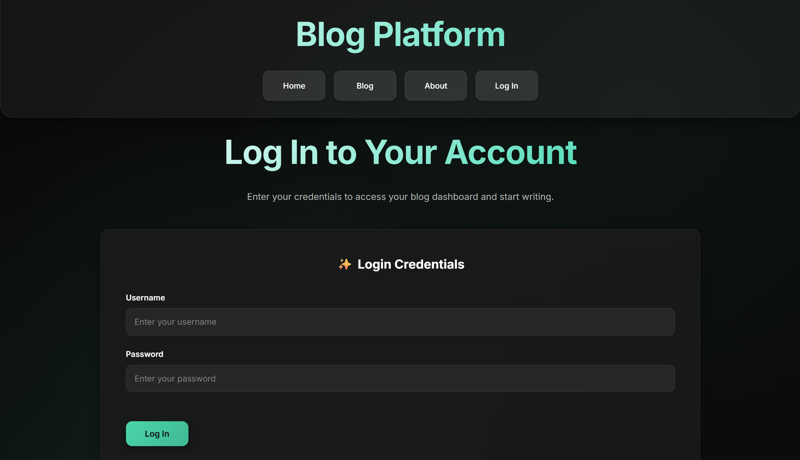

# Blog Platform

A modern, elegant blog platform built with Node.js, Express.js, and SQLite. Features a beautiful dark theme with glassmorphism effects, responsive design, and comprehensive content management capabilities.



## 🌟 Overview

This blog platform provides a complete solution for content creators and readers, offering a seamless experience for writing, publishing, and discovering blog posts. Built with modern web technologies and designed with user experience in mind.

## ✨ Key Features

### 🎨 **Modern Design**
- **Dark Theme**: Elegant dark color palette with teal accents
- **Glassmorphism Effects**: Frosted glass appearance with backdrop blur
- **Responsive Layout**: Optimized for desktop, tablet, and mobile devices
- **Smooth Animations**: Subtle transitions and hover effects
- **Typography**: Modern Inter font family for excellent readability

### 🔐 **Authentication & Security**
- **JWT Authentication**: Secure token-based authentication
- **Password Hashing**: bcrypt encryption for user passwords
- **Rate Limiting**: Protection against brute force attacks
- **Input Sanitization**: XSS protection with HTML sanitization
- **Secure Cookies**: HTTP-only, secure cookie implementation

### 📝 **Content Management**
- **Markdown Support**: Rich text formatting with Markdown
- **Post Creation**: Intuitive post creation and editing
- **Post Management**: Edit, delete, and organize your posts
- **User Dashboard**: Personal space to manage your content
- **Public Blog**: Discover posts from all users

### 🚀 **Performance & UX**
- **SQLite Database**: Lightweight, serverless database
- **EJS Templating**: Server-side rendering for fast page loads
- **Static File Serving**: Optimized asset delivery
- **Mobile-First Design**: Responsive across all screen sizes
- **Accessibility**: High contrast, keyboard navigation support

## 🛠️ Technology Stack

### Backend
- **Node.js** - JavaScript runtime
- **Express.js** - Web application framework
- **SQLite** - Lightweight database
- **JWT** - JSON Web Token authentication
- **bcrypt** - Password hashing
- **marked** - Markdown parser
- **sanitize-html** - HTML sanitization

### Frontend
- **EJS** - Embedded JavaScript templating
- **CSS3** - Modern styling with Grid and Flexbox
- **Google Fonts** - Inter and JetBrains Mono typography
- **Responsive Design** - Mobile-first approach

### Security
- **Rate Limiting** - Express rate limiting middleware
- **Input Validation** - Comprehensive input sanitization
- **XSS Protection** - HTML content sanitization
- **CSRF Protection** - SameSite cookie attributes

## 🚀 Quick Start

### Prerequisites
- **Node.js** (v16 or higher)
- **npm** or **yarn** package manager


## 📁 Project Structure

```
blog-platform/
├── app.js                    # Main application server
├── package.json              # Dependencies and scripts
├── .env                      # Environment variables
├── .gitignore               # Git ignore rules
├── README.md                # Project documentation
├── public/                  # Static assets
│   └── styles.css          # Main stylesheet with dark theme
├── views/                   # EJS templates
│   ├── includes/           # Reusable template components
│   │   ├── head.ejs        # HTML head section
│   │   ├── header.ejs      # Navigation header
│   │   └── footer.ejs      # Page footer
│   ├── homepage.ejs        # Landing page
│   ├── login.ejs           # User login
│   ├── dashboard.ejs       # User dashboard
│   ├── blog.ejs            # Public blog listing
│   ├── about.ejs           # About page
│   ├── create-post.ejs     # Post creation form
│   ├── edit-post.ejs       # Post editing form
│   └── single-post.ejs     # Individual post view
└── OurApp.db               # SQLite database (auto-created)
```

## 🔗 API Endpoints

| Method | Endpoint | Description | Authentication |
|--------|----------|-------------|----------------|
| `GET` | `/` | Homepage (dashboard for logged-in users) | Optional |
| `GET` | `/blog` | Public blog listing (all posts) | No |
| `GET` | `/about` | About page | No |
| `GET` | `/login` | Login page | No |
| `POST` | `/login` | User authentication | No |
| `POST` | `/signup` | User registration | No |
| `GET` | `/logout` | User logout | No |
| `GET` | `/create-post` | Create post page | Required |
| `POST` | `/create-post` | Create new post | Required |
| `GET` | `/post/:id` | View single post | No |
| `GET` | `/edit-post/:id` | Edit post page | Required |
| `POST` | `/edit-post/:id` | Update post | Required |
| `POST` | `/delete-post/:id` | Delete post | Required |

## 🎨 Design System

### Color Palette
- **Primary Background**: `#0a0a0a` (Deep black)
- **Secondary Background**: `#111111` (Dark gray)
- **Accent Color**: `#00d4aa` (Teal)
- **Text Primary**: `#ffffff` (White)
- **Text Secondary**: `#b3b3b3` (Light gray)
- **Glass Effects**: `rgba(255, 255, 255, 0.05)` (Semi-transparent)

### Typography
- **Primary Font**: Inter (Google Fonts)
- **Monospace Font**: JetBrains Mono
- **Font Weights**: 300, 400, 500, 600, 700, 800

### Components
- **Cards**: Glassmorphism with backdrop blur
- **Buttons**: Gradient backgrounds with hover effects
- **Forms**: Clean inputs with focus states
- **Navigation**: Sticky header with glassmorphism


### Database
The application uses SQLite with automatic table creation:
- **users**: User accounts and authentication
- **posts**: Blog posts and content
